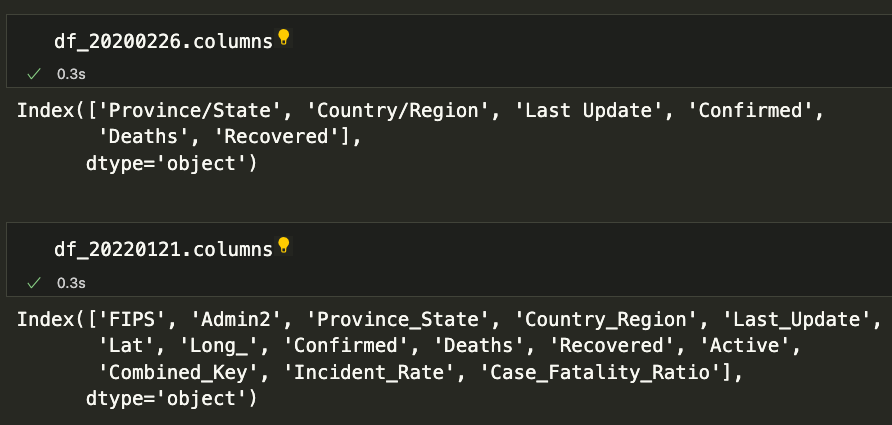
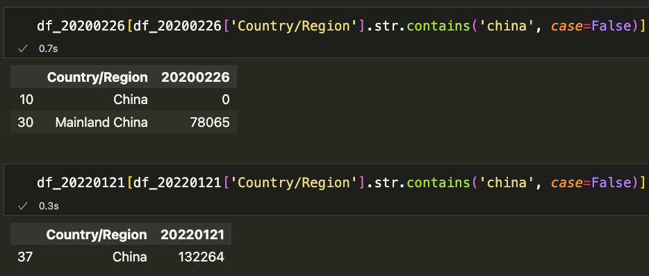

# Covid-Data-Visualization

## Demo
https://public.flourish.studio/visualisation/11812383/

## Data
- [COVID-19 Data Repository by the Center for Systems Science and Engineering (CSSE)](https://github.com/CSSEGISandData/COVID-19/tree/master/csse_covid_19_data/csse_covid_19_daily_reports)

---

## Notice

### Column names inconsistency

- **`Country_Region` VS. `Country/Region`**
- I decided to choose `Country_Region` as the column name because:
  - Slash `/` has another meaning in math.
  - Using `_` will allow me to select entire words faster by double click.

### Country names inconsistency

- **`Taiwan*` VS. `Taiwan`**
- **`Mainland China` VS. `China`**
- **`South Korea`	VS. `Korea, South`**
- I decided to choose `Taiwan`, `China` and `South Korea` as the consistent name.

---

## References

### [用 Python + Flourish 輕鬆搞定超酷的數據可視化](https://zhuanlan.zhihu.com/p/123309549?utm_id=0)

### [Don’t Use Python OS Library Any More When Pathlib Can Do](https://towardsdatascience.com/dont-use-python-os-library-any-more-when-pathlib-can-do-141fefb6bdb5)
- Pathlib is considered to be more advanced, convenient and provides more stunning features than the OS library.
  
### [Pathlib vs. os.path.join in Python](https://stackoverflow.com/questions/67112343/pathlib-vs-os-path-join-in-python)
- pathlib is the more modern way since Python 3.4. 
- The documentation for pathlib says that "For low-level path manipulation on strings, you can also use the os.path module."